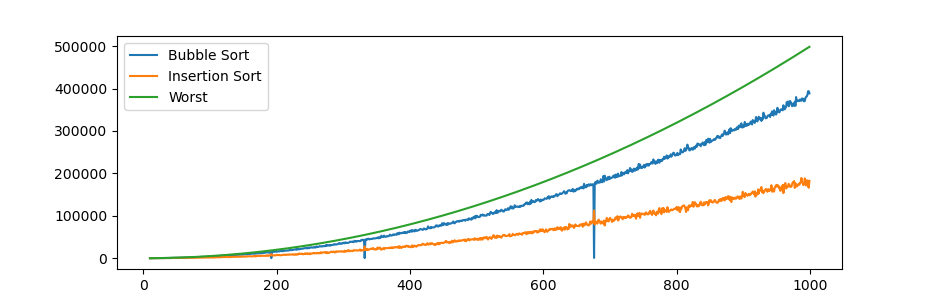

# Informe 1

[Guía para trabajar en informe 1](https://github.com/rilianx/ADA/blob/main/Guías%20para%20Informes/CriteriosEvaluacion.md)

## Problema de ordenamiento

El problema de ordenamiento es uno de los problemas más estudiados en el campo
de las ciencias de la computación. Este es resuelto por medio de variados
algoritmos que se comportan de mejor o peor manera dependiendo del arreglo a
ordenar. En el presente informe se analizará el comportamiento del algoritmo
**Insertion Sort** .

**Entrada**: Secuencia de n elementos $[a_1, a_2, ..., a_n]$

**Salida**: Permutación ordenada de la secuencia de entrada: $[a_1', a_2', ..., a_n']$
con $a_1' \leq a_2' \leq ... \leq a_n'$

## Descripción del algoritmo

El Insertion Sort consiste en recorrer el arreglo de izquierda a derecha. Cada
elemento será comparado con los elementos a su izquierda y reubicado hasta que su
posición sea la correcta.

Se recibe una lista $a$ con una serie de $n$ elementos a ser ordenados. Estos son
ordenados dentro de la misma lista.

- InsertionSort(A):
  - Se itera $i$ desde $1$ hasta $n$
    - Se itera $j$ de $i$ hasta $0$
      - Si el j-ésimo elemento del arreglo es menor que el elemento $A[j-1]$ del
      arreglo, intercambiamos su posición

## Insertion Sort

```python
from termcolor import cprint
def p(A, n ,s1 = -1, s2 = -1):
    for i in range(len(A)):
        if (n == i): cprint (A[i], "red", end = " ")
        elif (i < n): cprint(A[i], "green", end = " ")
        else: print(A[i], end = " ")
    print()

def sort(a: list, verbose: bool = False):
    aux = 0
    n = len(a)
    if verbose: print("Arreglo", a, ":")
    for i in range(1, n):
        if verbose: p(a, i)
        j = i
        while (a[j] < a[j-1] and j > 0):
            a[j], a[j-1] = a[j-1], a[j]
            aux+=1
            if verbose:
                print (f"Intercambiamos: ({a[j]},{a[j-1]})")
            j -= 1
    return a, aux

print(sort([9,8,7,6,5,4,3,2,1], True))
```

## Análisis del algoritmo

Añadiremos una variable auxiliar para obtener la
cantidad de veces que el agoritmo debe retroceder
al realizar el ordenamiento. A mayor el valor de
esta variable auxiliar, peor será el caso
correspondiente.

## Ejemplo

Sea $a = [\color{blue}{8}\color{reset}, 3, 7, 5, 9]$

Partimos de izquierda a derecha. Podemos decir que el
primer elemento esta ordenado ya que no tiene ningún
elemento menor a su izquierda, así que la primera
iteración parte del segundo valor. Con el objetivo de facilitar
la lectura los elementos ordenados tendrán el color azul y el
elemento actual ($A[i])$ tendrá  color rojo.

$a = [\color {blue} 3, \color {red} 8 \color {reset}, 7, 5, 9]$

El $3$ es menor que el $8$. Para llevarlo a su
posición correspondiente lo desplazamos una casilla
hacia la derecha.

$a = [\color {blue} 3, 8 \color {reset}, \color {red}
7 \color {reset}, 5, 9]$

El $7$ necesita ser reubicado, al igual que el $8$ lo
desplazamos una posición a la izquierda

$a = [\color {blue} 3, 7, 8 \color {reset},
\color {red} 5 \color {reset}, 9]$

El cinco necesita desplazarse dos posiciones para
llegar a su posición ideal

$a = [\color {blue} 3, 7, \color {red}5 \color {reset}, 8, 9]$

$a = [\color {blue} 3, \color {red}5 \color {blue} , 7, 8, 9]$

$a = [\color {blue} 3, 5 , 7, 8,\color {red} 9\color {reset}]$

Ya en la última posición el arreglo se encuentra completamente ordenado

## Propiedad invariante del bucle

Para demostrar la correctitud del algoritmo es necesario
establecer condiciones que se cumplan a lo largo de la
ejecución del algoritmo.

En el caso del InsertionSort recorremos los elementos del
arreglo $a$ con un contador $i$. A mano izquierda de la
posición $a[i]$ se forma un subarreglo ordenado de longitud $i$.
En cada iteración del ciclo nos aseguramos de que este subarreglo
se mantenga ordenado con la ayuda de un contador $j$, si se encuentra un
elemento $A[j]$ mayor que $A[j-1]$ se desplazará hasta que $A[j-1]$ sea menor
que $A[j]$.

### Correctitud

El algoritmo concluye una vez que $i = n + 1$. Como antes de finalizar la última
iteración nos aseguramos de que el último elemento se desplaza a su posición
correspondiente entonces podemos afirmar que el subarreglo se encuentra
completamente ordenado. Como sabemos que el tamaño del subarreglo es de
$i$ y que $i = n + 1$ Podemos decir que la longitud del subarreglo ordenado
es de $n$ y por ende que todo el arreglo está ordenado.

## Tiempo de ejecución

El tiempo de ejecución de InsertionSort está condicionado tanto por el orden
los valores como de la longitud del arreglo.

### Peor caso

El peor caso se da cuando el arreglo está en un orden inverso al orden objetivo
debido a que cada elemento debe desplazarse $i$ posiciones en cada iteración. En
concreto se realizarán $\sum_{i = 1}^n i$ permutaciones. O lo que es lo mismo,
$\cfrac {n(n-1)} {2}$. De esto podemos concluir que el tiempo de ejecución en el
peor caso es de $O(n^2)$

### Mejor caso

El mejor caso se da cuando el arreglo está completamente ordenado ya que no
se realiza ninguna comparación y por ende ningún intercambio. Al no realizar
permutaciones podemos decir que el tiempo de ejecución del mejor caso es de
$O(n)$. Esto hace que el InsertionSort sea una excelente opción cuando el
arreglo a ordenar está mayoritaria o completamente ordenado.

### Número de comparaciones

Si bien el algoritmo Bubble Sort e Insertion Sort comparten el tiempo de
ejecución en su mejor, peor, y caso promedio, estos no se comportan de igual
manera. Con el objetivo de identificar cual se comporta de mejor manera se
analizará la cantidad de veces en las que el algoritmo realiza un cambio de
posición de un elemento del arreglo y se comparará con el algoritmo BubbleSort.

```python
def b_sort(A):
    aux = 0
    for i in range (len(A) - 1):
        swap = False
        for j in range (len(A) - i - 1):
            aux += 1
            if (A[i] < A[j]):
                A[i], A[j] = A[j], A[i]
                swap = True
        if not swap:
            return A, aux
    return A, aux
def ins_sort(A):
    aux = 0
    for i in range(len(A)):
        j = i
        aux +=1
        while (A[j] < A[j-1] and j > 0):
            A[j], A[j-1] = A[j-1], A[j]
            aux +=1
            j -=1
    return A, aux;


print(ins_sort(list(range(10))))

y = []
y2 = []
samples = 1000
x = [n for n in range (10, samples)]
y3 = [n * (n-1) / 2 for n in range (10, samples)]
for n in range(10, samples):
    arr = random.sample(range(1, samples), n)
    a, count = b_sort(arr)
    y.append(count);
    a, count = ins_sort(arr)
    y2.append(count);

plt.plot(x, y)
plt.plot(x, y2)
plt.plot(x, y3)
plt.legend(["Bubble Sort", "Insertion Sort", "Worst"])
plt.show()
```



Como podemos observar, dado un arreglo aleatorio ambos algoritmos se comportan
de manera similar hasta un tamaño de 200 elementos. Sin embargo a medida que
nos alejamos de esta cifra la diferencia aumenta considerablemente. Como el peor
caso señalado en la gráfica es el mismo para ambos algoritmos podemos concluir
que en casos generales el algoritmo InsertionSort se mantendrá más alejado del
peor caso posible, por lo tanto ofreciendo un mejor rendimiento.
